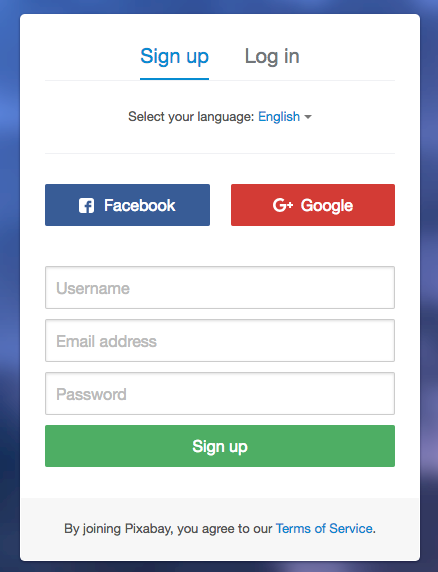
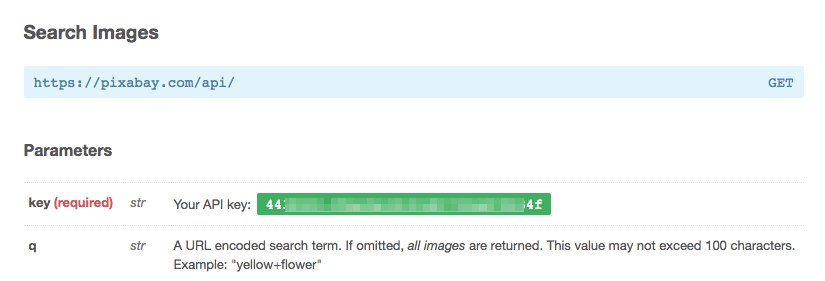
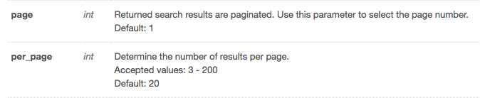
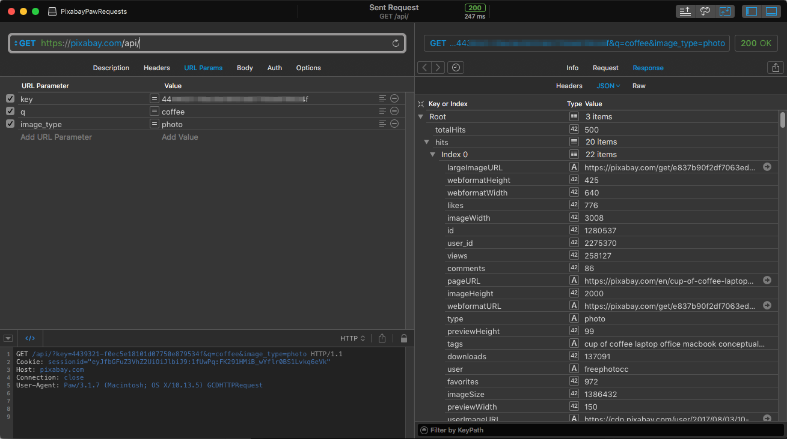
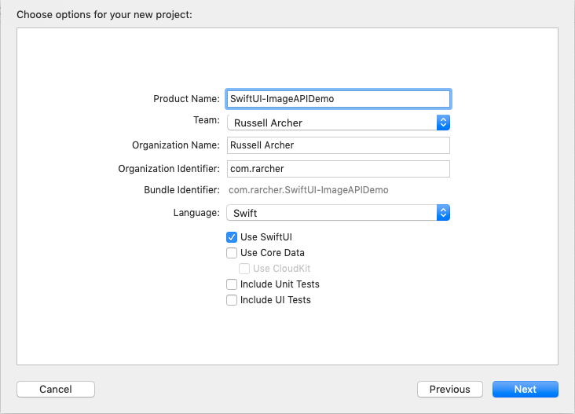
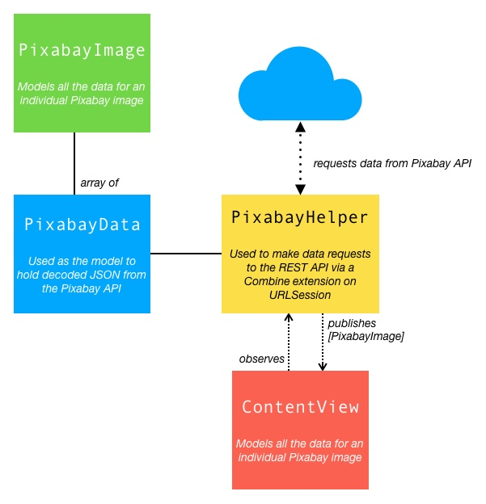
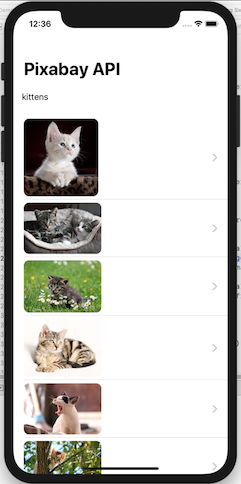

# SwiftUI-ImageAPIDemo
## Using SwiftUI and Combine to consume REST API image data
**(Updated for Xcode 11 Beta 6)**

In this SwiftUI and Combine demo I create a simple iOS app that requests image data from Pixabay (https://pixabay.com) using its free REST-based API that returns JSON data.
**SwiftUI** is used to create the UI and the new **Combine** framework is used to asynchronously request and decode JSON image data.

See https://github.com/russell-archer/ImageApiDemo for details of how to accomplish the same thing with UIKit.

The source in the repo shows the completed final version of the app. The text below provides details on how the app was created.


___

## Get a free Pixabay account
First, register for an account at https://pixabay.com/en/accounts/register/



Once you login to your account on Pixabay you’ll be able to see your API key in https://pixabay.com/api/docs/:



Queries are very simple. The main parameters are:

**key** - Your API key<br>
**q** - What you’re searching for (URL encoded)<br>
**image_type** - The type of image you want ("all", "photo", "illustration", “vector")<br>

For example, we can look for "coffee" photos (the **q** parameter must be URL encoded) with:

https://pixabay.com/api/?key=your-api-key&q=coffee&image_type=photo

Note that there are also **page** and **per_page** parameters which we can use to implement lazily-loaded paginated data:



We can test the query in an HTTP client such as **Paw** (https://paw.cloud/):



Useful values returned in the response include:

**totalHits**
The number of images accessible through the API. By default, the API is limited to return a maximum of 500 images per query.

**hits**
A collection of image metadata, including URLs for a preview image, large image, etc.

___

## Create a new Xcode project
Create a new project in Xcode named **SwiftUI-ImageApiDemo**:



The overall design for the app will be as follows:



* A struct named **PixabayData**
    * Conforms to the **Decodable** protocol. This allows us to to use Swift’s **JSONDecoder** to automatically decode JSON
    * Used as the model to map incoming raw JSON data from the Pixabay web API
    * The **hits** member of the struct will hold an array of image metadata (**PixabayImage**)

``` swift
public struct PixabayData: Decodable {
    public var totalHits: Int
    public var hits: [PixabayImage]
    public var total: Int
}
```

* A struct named **PixabayImage**
    * Conforms to the **Decodable** protocol
    * Models all the data for an individual Pixabay image

``` swift
public struct PixabayImage: Decodable, Identifiable {
    public var id: Int
    public var largeImageURL: String
    public var webformatHeight: Int
    :
    :
}
```

* A class named **PixabayHelper**
    * Used to make data requests to the REST API via a **Combine** extension **dataTaskPublisher(for:)** on **URLSession** 
    * Decodes the incoming JSON data and caches it in a **pixabayData** property
    * Makes the **PixabayData.hits** array of **PixabayImage** data available via a public **@Published imageData** property. Publishing imageData ensures that when it changes the **View** in **ContentView** is re-rendered
    * Conforms to the SwiftUI **BindableObject** protocol. This allows **ContentView** to subscribe to changes via a **@ObservedObject PixabayHelper** property
    
* Main **ContentView** struct
    * Will show a collection of preview images from the Pixabay data using a SwiftUI **List**
    * Displays a **TextField** and **Button** allowing a search term to be entered
    * Holds a **@ObservedObject PixabayHelper** property. When the data (**imageData**) changes the **View** is invalidated and re-rendered

* We store static query string elements in a .plist file and use a class **PropertyFileHelper** to help retrieve values. This avoids having to hard-code items like the unique API key
* When the user taps on a preview image we show the full image in a separate detail view
* The user enters a search term for the images to be retrieved. Note that SwiftUI does not yet support the equivalent of **UISearchController** so we create our own simple alternative

___

## Configure access to Pixabay URL
First, the default security configuration for iOS will not allow requests to random URLs. You need to explicitly configure access to Pixabay by adding the following to your **Info.plist**:

```
<key>NSAppTransportSecurity</key>
<dict>
    <key>NSExceptionDomains</key>
    <dict>
        <key>pixabay.com</key>
        <dict>
            <key>NSExceptionAllowsInsecureHTTPLoads</key>
            <true/>
        </dict>
    </dict>
</dict>
```

___

## Create a Pixabay configuration plist and helper
Create a new .plist file named **Pixabay.plist**.  
Open it as source code and add the following:

```
<?xml version="1.0" encoding="UTF-8"?>
<!DOCTYPE plist PUBLIC "-//Apple Computer//DTD PLIST 1.0//EN" "http://www.apple.com/DTDs/PropertyList-1.0.dtd">
<plist version="1.0">
<dict>
    <key>PixabayUrl</key>
    <string>https://pixabay.com/api/?key=</string>
    <key>PixabayApiKey</key>
    <string>your-api-key-goes-here</string>
    <key>PixabayImageType</key>
    <string>image_type=photo</string>
</dict>
</plist>
```

Create a new .swift file named **PropertyFileHelper.swift** and add the following:

``` swift
//
//  PropertyFileHelper.swift
//  SwiftUI-ImageAPIDemo
//
//  Created by Russell Archer on 13/07/2019.
//  Copyright © 2019 Russell Archer. All rights reserved.
//

import Foundation
import UIKit

/*
 
 PropertyFileHelper reads the contents of a .plist file and allows you to read individual
 properties by their keys.
 
 Example usage:
 
 let _plistHelper = PropertyFileHelper(file: "MyPlistFile")  // Note: No .plist file extn
 guard _plistHelper.hasLoadedProperties else { return }
 guard var myValue = _plistHelper.readProperty(key: "MyKey") else { return }
 
 */

public class PropertyFileHelper {
    fileprivate var propertyFile: [String : AnyObject]?
    public var hasLoadedProperties: Bool { return propertyFile != nil ? true : false }
    
    /// Create a property list helper. Creating the helper also reads the contents of the property list.
    /// - Parameter file: The name of the property file, without the .plist extension
    init(file: String) {
        propertyFile = readPropertyFile(filename: file)
    }
    
    /// Read a property from a dictionary of values that was read from a plist.
    /// - Parameter key: Key that identifies an element in the property list
    public func readProperty(key: String) -> String? {
        guard propertyFile != nil else { return nil }
        if let value = propertyFile![key] as? String {
            return value
        }
        
        return nil
    }
    
    /// Read a plist property file and return a dictionary of values.
    /// - Parameter filename: The name of the property file, without the .plist extension
    fileprivate func readPropertyFile(filename: String) -> [String : AnyObject]? {
        if let path = Bundle.main.path(forResource: filename, ofType: "plist") {
            if let contents = NSDictionary(contentsOfFile: path) as? [String : AnyObject] {
                return contents
            }
        }
        
        return nil  // [:]
    }
}
```
___

## Create the data models
Now create the data models by adding a new file named **PixabayData.swift**:

``` swift
//
//  PixabayData.swift
//  SwiftUI-ImageAPIDemo
//
//  Created by Russell Archer on 13/07/2019.
//  Copyright © 2019 Russell Archer. All rights reserved.
//

import Foundation
import SwiftUI

public struct PixabayData: Decodable {
    public var totalHits: Int
    public var hits: [PixabayImage]
    public var total: Int
}

public struct PixabayImage: Decodable, Identifiable {
    public var id: Int
    public var largeImageURL: String
    public var webformatHeight: Int
    public var webformatWidth: Int
    public var likes: Int
    public var imageWidth: Int
    public var userId: Int
    public var views: Int
    public var comments: Int
    public var pageURL: String
    public var imageHeight: Int
    public var webformatURL: String
    public var type: String
    public var previewHeight: Int
    public var tags: String
    public var downloads: Int
    public var user: String
    public var favorites: Int
    public var imageSize: Int
    public var previewWidth: Int
    public var userImageURL: String
    public var previewURL: String
    
    // Use coding keys to map "user_id" to "userId"
    // If you remap one JSON field you have to supply all the other unmapped fields too
    enum CodingKeys: String, CodingKey {
        case largeImageURL
        case webformatHeight
        case webformatWidth
        case likes
        case imageWidth
        case id
        case userId = "user_id"
        case views
        case comments
        case pageURL
        case imageHeight
        case webformatURL
        case type
        case previewHeight
        case tags
        case downloads
        case user
        case favorites
        case imageSize
        case previewWidth
        case userImageURL
        case previewURL
    }
    
    init(imageName: String) {
        id = 0
        largeImageURL = imageName
        webformatHeight = 0
        webformatWidth = 0
        likes = 0
        imageWidth = 0
        userId = 0
        views = 0
        comments = 0
        pageURL = imageName
        imageHeight = 0
        webformatURL = imageName
        type = "photo"
        previewHeight = 0
        tags = ""
        downloads = 0
        user = ""
        favorites = 0
        imageSize = 0
        previewWidth = 0
        userImageURL = imageName
        previewURL = imageName
    }
}
```

___

## Create a PixabayHelper to handle getting data from the REST API
Create a class named PixabayHelper in a file named **PixabayHelper.swift**:

``` swift
//
//  PixabayHelper.swift
//  SwiftUI-ImageAPIDemo
//
//  Created by Russell Archer on 13/07/2019.
//  Copyright © 2019 Russell Archer. All rights reserved.
//
//  Example Pixabay query: https://pixabay.com/api/?key=key-here&image_type=photo&per_page=5&q=coffee
//

import Foundation
import UIKit
import SwiftUI
import Combine

class PixabayHelper: ObservableObject {
    fileprivate let plistHelper = PropertyFileHelper(file: "Pixabay")  // Allows us access to the Pixabay.plist config file
    fileprivate var pixabayData: PixabayData?  // Holds decoded JSON data loaded from Pixabay
    fileprivate var currentSearchText = ""
    fileprivate enum networkError: Error { case statusCodeIndicatesError }
    
    // Configuration data
    fileprivate var pixabayUrl: String
    fileprivate let pixabayApiKey: String
    fileprivate let pixabayImageType: String
    fileprivate let pixabayResultPerPage: String
    
    /// This published imageData ensures that when the data changes the View in ContentView is re-rendered
    @Published public var imageData: [PixabayImage] = [PixabayImage(imageName: "OwlSmall")]
    
    init() {
        pixabayUrl = plistHelper.readProperty(key: "PixabayUrl")!
        pixabayApiKey = plistHelper.readProperty(key: "PixabayApiKey")!
        pixabayImageType = plistHelper.readProperty(key: "PixabayImageType")!
        pixabayResultPerPage = plistHelper.readProperty(key: "PixabayResultsPerPage")!
    }
    
    /// Gets image data from the Pixabay REST API
    /// - Parameter searchFor: The kind of image to search for
    public func loadImages(searchFor: String) {
        if searchFor == currentSearchText { return }
        currentSearchText = searchFor

        pixabayUrl += pixabayApiKey + "&" + pixabayImageType + "&" + pixabayResultPerPage + "&q=" + searchFor
        
        // Use the dataTaskPublisher(for:) Combine extension on URLSession to request data asynchronously
        let _ = URLSession.shared.dataTaskPublisher(for: URLRequest(url: URL(string: pixabayUrl)!))
            .receive(on: RunLoop.main)  // The whole chain fails without this!
            .tryMap { data, response -> Data in
                guard let httpResponse = response as? HTTPURLResponse, httpResponse.statusCode == 200 else {
                    throw networkError.statusCodeIndicatesError
                }

                return data  // Pick off just the JSON data
            }
            .decode(type: PixabayData.self, decoder: JSONDecoder())  // Decode the JSON using our PixabayData model
            .sink(receiveCompletion: { _ in }, receiveValue: { decodedData in
                // Cache the received and decoded data
                self.pixabayData = decodedData
                self.imageData = self.pixabayData == nil ? [PixabayImage(imageName: "OwlSmall")] : self.pixabayData!.hits
            })
    }
}
```

___

## Create the UI
Open **ContentView.swift** and add the following:

``` swift
//
//  ContentView.swift
//  SwiftUI-ImageAPIDemo
//
//  Created by Russell Archer on 13/07/2019.
//  Copyright © 2019 Russell Archer. All rights reserved.
//
//  Updated for Xcode Beta 5
//      -   @ObjectBinding deprecated for @ObservedObject
//      -   BindableObject protocol deprecated for ObservableObject in PixabayHelper
//      -   Refactored PixabayHelper.loadImages(searchFor:) to use the Combine framework extension dataTaskPublisher on URLSession
//      -   Refactored PixabayHelper to @Published imageData

import SwiftUI

struct ContentView : View {
    @ObservedObject var pixabayHelper = PixabayHelper()  // When our data model changes the View is invalidated and re-rendered
    @State fileprivate var searchText = ""
    
    var body: some View {
        NavigationView {
            VStack {
                HStack {
                    TextField("Enter search term", text: $searchText).padding()
                    
                    Button(action: {
                        self.pixabayHelper.loadImages(searchFor: self.searchText)
                    }) {
                        Image(systemName: "magnifyingglass").font(.largeTitle)
                    }
                    .padding()
                }
                
                List(pixabayHelper.imageData) { dataItem in
                    NavigationLink(destination: Image(uiImage: self.createImage(url: dataItem.webformatURL))) {
                        Image(uiImage: self.createImage(url: dataItem.previewURL))
                            .resizable()
                            .frame(width: (CGFloat)(dataItem.previewWidth), height: (CGFloat)(dataItem.previewHeight))
                            .aspectRatio(contentMode: .fit)
                    }
                }
            }
            .navigationBarTitle(Text("Pixabay API"))
        }
    }
    
    /// Helper function that returns a UIImage from a URL. If the URL is invalid a default image is returned.
    /// - Parameter url: URL of a Pixabay image preview
    fileprivate func createImage(url: String) -> UIImage {
        if let imageUrl = URL(string: url), let imageData = try? Data(contentsOf: imageUrl) {
            return UIImage(data: imageData)!
        }
        
        return UIImage(named: "OwlSmall")!  // Return a default image
    }
}

#if DEBUG
struct ContentView_Previews : PreviewProvider {
    static var previews: some View {
        ContentView()
    }
}
#endif
```

___

Note that we've include navigation support to show a bigger detail image.

Wrap the existing **VStack** in a **NavigationView** (equivalent of UIKit **UINavigationController**).
Wrap the **Image** displayed in the **List** in a **NavigationLink**.

Note that when the navigation link is tapped the destination is simply an **Image**. This works because the **NavigationLink** destination can be any object that conforms to the **View** protocol.

Running the app produces:



Tapping a preview image in the **List** produces:


