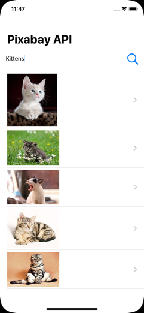

# SwiftUI-ImageAPIDemo
Using SwiftUI to consume REST API with image data

In this simple SwiftUI demo we create a simple iOS app that requests image data from Pixabay (https://pixabay.com) using its free REST-based API that returns JSON data.

First, register for an account at https://pixabay.com/en/accounts/register/

Once you login to your account on Pixabay you’ll be able to see your API key in https://pixabay.com/api/docs/:

Queries are very simple. The main parameters are:

**key** - Your API key
**q** - What you’re searching for (URL encoded)
**image_type** - The type of image you want ("all", "photo", "illustration", “vector")

For example, we can look for "coffee" photos (the q parameter must be URL encoded) with:

https://pixabay.com/api/?key=your-api-key&q=coffee&image_type=photo

Note that there are also page and per_page parameters which we can use to implement lazily-loaded paginated data:
